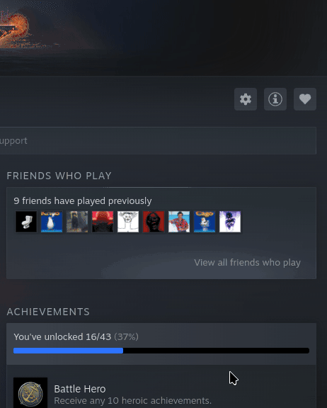
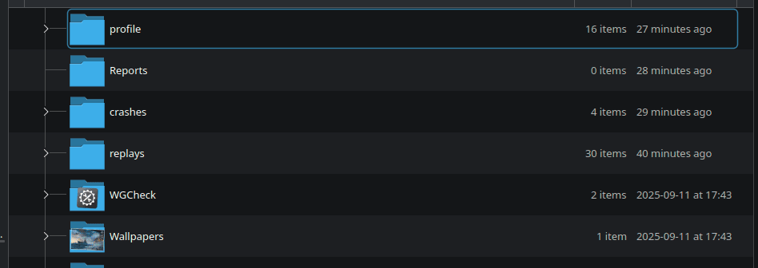
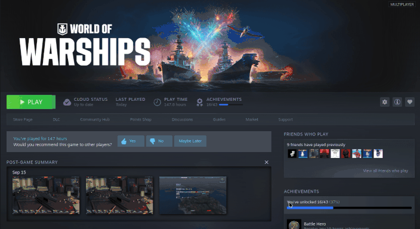

# View World of Warships replays on Linux

Hi!

This is a quick guide on how to view **World of Warships replay files** when using the **steam version** of the game on **Linux**. It is really really easy, you don't even have to download anything or run any commands in the terminal, but I couldn't find any info on it online.

## Locate replay files

These are located in the game contents folder. The easiest way to find them is to use the steam feature *browse local files*

Click on the gear icon, then manage, then browse local files

## Copy path to replay file

Once in the game contets folder, click in to the replay folder and **copy the location** to the replay file you want to view.

## Paste the copied path as a launch option

Pasting the copied location as a launch option will execute it using worldofwarships64.exe through proton and steam. 

**Add quotation marks (") around the copied path since there are spaces in the path**

## Done!

That is it. Press play in steam and the replay file should launch. If you want to launch the game normally again, just remove the added launch option.

[Here](https://wargaming.net/support/en/products/wows/article/15038/) is an article describing the process on windows. It also describes the **keybindings to control the replay**

